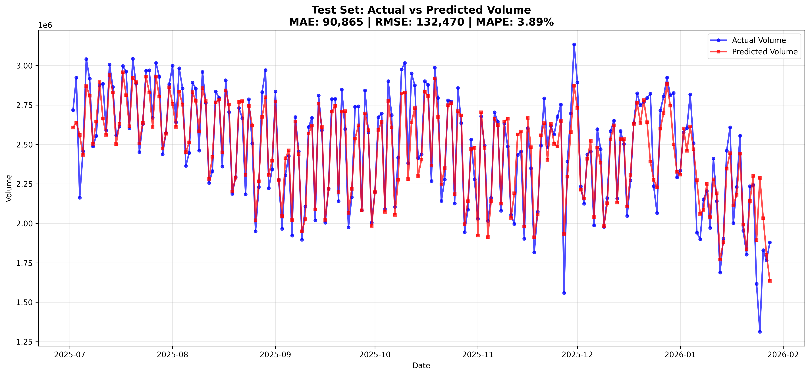
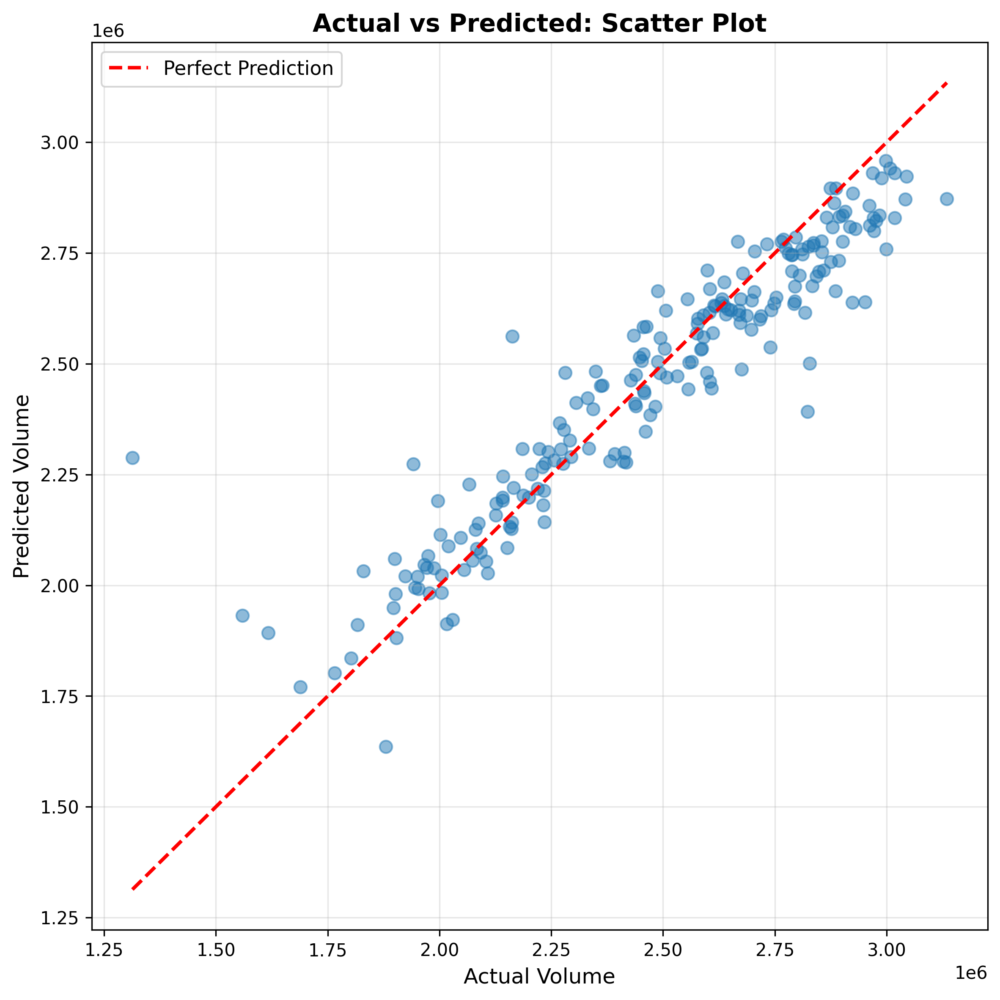

---

# TSA Volume Forecasting

This project forecasts daily U.S. TSA passenger volume using an **XGBoost regression model** with calendar, lag, holiday, and weather features.

---

## Files

### `get_weather.py`

* Pulls historical weather data from **Open-Meteo**
* Aggregates data from major U.S. hub cities
* Engineers disruption-focused weather features (e.g., severe weather flags, wind/snow metrics)
* Outputs: weather_data.csv

---

### `main.py`

* Loads:

  * `tsa_train.csv`
  * `tsa_test.csv`
  * `weather_data.csv`
* Performs chronological feature engineering:

  * Calendar + cyclical features
  * Holiday ramp features (Thanksgiving & Christmas)
  * Lag, rolling, and EWMA features
  * Weather features
* Trains an **XGBoost model**
* Generates test predictions

* Produces evaluation plots:

  * `test_actual_vs_predicted.png`
  * `test_scatter_plot.png`

---

## How to Run

```bash
python get_weather.py
python main.py
```

---

## Example Outputs

### Actual vs Predicted



### Scatter Plot



